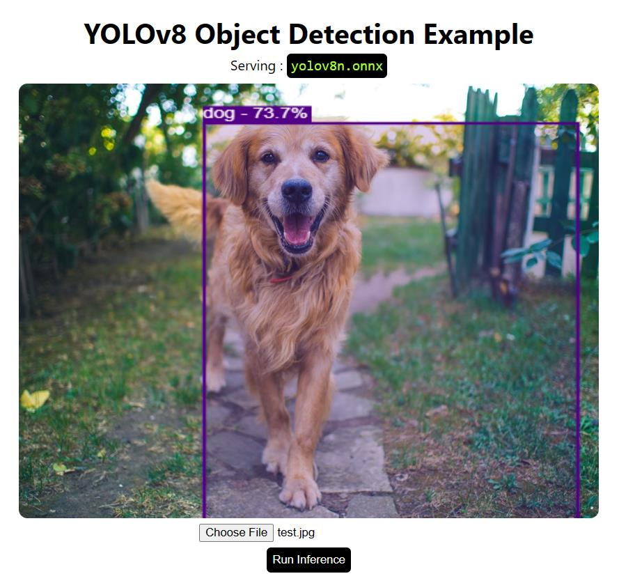

<p align="center">
  
</p>


This is adapted and rewritten version of YOLOv8 object segmentation (powered by onnx). This version can be run on JavaScript without any frameworks and demonstrates object detection using web camera.

## Setup
To see it at work, just run index.html file. 

## Models

**Main Model**

YOLOv8n model converted to onnx with input dimensions of 416x416. 

```
used model : yolov8n.onnx
size       : ~ 12.5Mb
```

**NMS**

ONNX model to perform NMS operator [CUSTOM].

```
nms-yolov8.onnx
```


## Use another model

It is possible to use bigger models converted to onnx, however this might impact the total loading time.

To use another YOLOv8 model, download it from Ultralytics and convert it to onnx file format.

**Custom YOLOv8 Object Detection Models**

Please update labels object inside of main.js file.

## Updates
Added another web camera based example for YOLOv8 running without any frameworks. In this example there is no need for NMS operator, but it is slower. See:  "yolov8_onnx_without_nms" folder. 

## Demo
To see demo, please visit the <a href="https://yolov8-object-detection.glitch.me/">following page</a>
